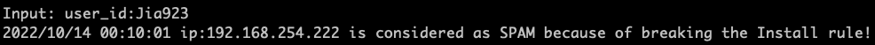

# Spam Assessment using Go and gRPC

This project is a spam assessment application based on Go programming language and gRPC. Users input the data they like to assess and send it to the server. After appplying assessment functions, the server respond the result back to the client.


## Usage
1. Git clone this project

	```
	git clone https://github.com/tinahhhhh/go-grpc.git
	```
	
### Run locally
1. Install Go from [here](https://go.dev/doc/install)
2. Install gRPC


	```
	go install google.golang.org/grpc/cmd/protoc-gen-go-grpc@v1.2 
   go install google.golang.org/protobuf/cmd/protoc-gen-go@v1.28
   export PATH="$PATH:$(go env GOPATH)/bin"s
	``` 
3. Install Protocol buffer compiler

	```
	apt install -y protobuf-compiler
	```

4. Run the server (Please provide the url.)

	```
	go run server/main.go -url https:xxx
	```

5. Run the client

	```
	go run client/main.go
	```
	
6. Input the data you like to spam check in the client under the format "entity\_type:entity\_value".

	```
	e.g. user_id:xxx
	     email:xxx@xxx.com
	     ip: xx.xx.xx.xx
	``` 


### Run on docker continers [Testing]
TODO: Use docker composer to make client and server contrainer comunicate. 
      Use socat to execute STDIN to the client container. 
      **The following commands and server address in client code need to be modified according to docker network environment.**

1. **Modify** the **server/Dockerfile** file (In the last line (#22)) by providing URL for the data source.

	```
	ENTRYPOINT cd /go/src/grpc-client && go run main.go -url https:xxx
	```
2. Run the server (Please provide the url.)

	```
	cd server
	docker build . -t server 
	docker run server -p 50051:50051
	```
3. Run the client

	```
	cd client
	docker build . -t client 
	docker run -i client -p 50051:50051
	```

4. Input the data you like to spam check in the client under the format "entity\_type:entity\_value".

	```
	e.g. user_id:xxx
	     email:xxx@xxx.com
	     ip: xx.xx.xx.xx
	``` 
	
## Result

  


## Unit Test

```
	cd server
	go test
```

## References
1. [build go + grpc](https://grpc.io/docs/languages/go/quickstart/)
2. [grpc-go hello world](https://github.com/grpc/grpc-go/tree/master/examples/helloworld)
3. [HTTP Get method in Golang](https://blog.alexellis.io/golang-json-api-client/)
4. [gojsonq package](https://github.com/thedevsaddam/gojsonq)
5. [unit test in Go](https://go.dev/doc/tutorial/add-a-test)
