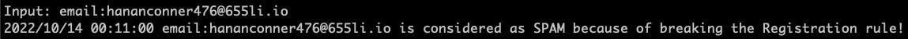
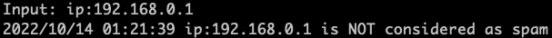

# Spam Assessment using Go and gRPC

This project is a spam assessment application based on Go programming language and gRPC. Users input the data they like to assess and send it to the server. After appplying assessment functions, the server respond the result back to the client.


## Usage
1. Git clone this project

	```
	git clone https://github.com/tinahhhhh/go-grpc.git
	```

2. **Modify** the **server/Dockerfile** file (In the last line (#22)) by providing URL for the data source.

	```
	ENTRYPOINT cd /go/src/grpc-client && go run main.go -url https:xxx
	```
3. Run the server

	```
	cd server
	docker build . -t server
	docker run server
	```
4. Run the client

	```
	cd client
	docker build . -t client
	docker run client
	```

5. Input the data you like to spam check in the client under the format "entity\_type:entity\_value".

	```
	e.g. user_id:xxx
	     email:xxx@xxx.com
	     ip: xx.xx.xx.xx
	``` 
6. Result

     
    
    

## Test

## References
1. [build go + grpc](https://grpc.io/docs/languages/go/quickstart/)
2. [grpc-go hello world](https://github.com/grpc/grpc-go/tree/master/examples/helloworld)
3. [HTTP Get method in Golang](https://blog.alexellis.io/golang-json-api-client/)
4. [gojsonq package](https://github.com/thedevsaddam/gojsonq)
5. [unit test in Go](https://go.dev/doc/tutorial/add-a-test)
